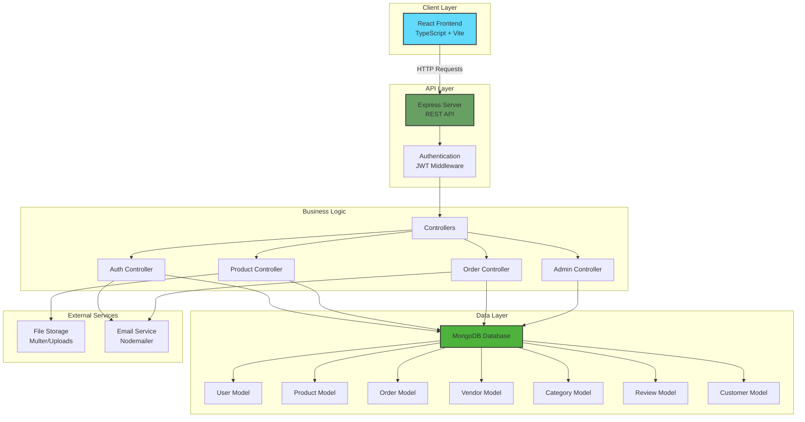
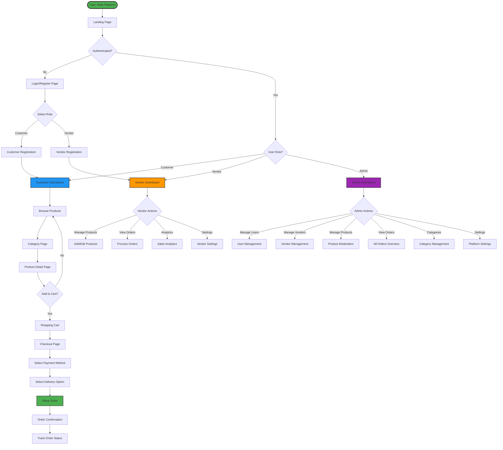

# 🛍️ Multi E-Commerce Platform

A full-stack multi-vendor e-commerce platform built with **React**, **TypeScript**, **Node.js**, **Express**, and **MongoDB**. This platform supports multiple user roles including Customers, Vendors, and Admins with comprehensive features for product management, order processing, and analytics.

---

## 📋 Table of Contents

- [Features](#-features)
- [Tech Stack](#-tech-stack)
- [System Architecture](#-system-architecture)
- [User Flow](#-user-flow)
- [Installation](#-installation)
- [Environment Variables](#-environment-variables)
- [Running the Application](#-running-the-application)
- [API Endpoints](#-api-endpoints)
- [Project Structure](#-project-structure)

---

## ✨ Features

### 👤 Customer Features
- **User Authentication** - Secure login/registration with JWT
- **Product Browsing** - Browse products by categories
- **Product Search** - Search and filter products
- **Shopping Cart** - Add/remove items, manage quantities
- **Checkout Process** - Multiple payment and delivery options
- **Order Tracking** - View order history and status
- **Product Reviews** - Rate and review purchased products
- **Pre-Booking** - Reserve products before official launch

### 🏪 Vendor Features
- **Vendor Dashboard** - Comprehensive analytics and insights
- **Product Management** - Add, edit, delete products
- **Inventory Control** - Track stock levels
- **Order Management** - Process and fulfill orders
- **Sales Analytics** - View sales charts and statistics
- **Vendor Profile** - Manage store information and settings
- **Location-based Services** - Geospatial indexing for vendor locations

### 👨‍💼 Admin Features
- **Admin Dashboard** - Platform-wide analytics
- **User Management** - Manage customers and vendors
- **Product Moderation** - Approve/reject vendor products
- **Order Overview** - Monitor all platform orders
- **Category Management** - Create and manage product categories
- **Platform Settings** - Configure system-wide settings

---

## 🛠️ Tech Stack

### Frontend
- **React 19** - UI library
- **TypeScript** - Type-safe JavaScript
- **Vite** - Fast build tool and dev server
- **React Router DOM** - Client-side routing
- **Tailwind CSS** - Utility-first CSS framework
- **Recharts** - Data visualization for analytics

### Backend
- **Node.js** - JavaScript runtime
- **Express.js** - Web application framework
- **MongoDB** - NoSQL database
- **Mongoose** - MongoDB object modeling
- **JWT** - Authentication tokens
- **bcryptjs** - Password hashing
- **Multer** - File upload handling
- **Nodemailer** - Email notifications
- **Morgan** - HTTP request logger

---

## 🏗️ System Architecture



---

## 🔄 User Flow



---

## 📦 Installation

### Prerequisites
- **Node.js** (v16 or higher)
- **MongoDB** (v5 or higher)
- **npm** or **yarn**

### Clone Repository
```bash
git clone https://github.com/Sumitkmt946/Multi-E-Commerce-.git
cd Multi-E-Commerce-
```

### Install Backend Dependencies
```bash
cd backend
npm install
```

### Install Frontend Dependencies
```bash
cd ../frontend
npm install
```

---

## 🔐 Environment Variables

Create a `.env` file in the `backend` directory:

```env
# Server Configuration
PORT=5000
NODE_ENV=development

# Database
MONGO_URI=mongodb://localhost:27017/ecommerce

# JWT Secret
JWT_SECRET=your_jwt_secret_key_here

# Email Configuration (Nodemailer)
EMAIL_HOST=smtp.gmail.com
EMAIL_PORT=587
EMAIL_USER=your_email@gmail.com
EMAIL_PASS=your_email_password

# Frontend URL (for CORS)
FRONTEND_URL=http://localhost:5173
```

---

## 🚀 Running the Application

### Start MongoDB
```bash
# Make sure MongoDB is running
mongod
```

### Start Backend Server
```bash
cd backend
npm run dev
# Server runs on http://localhost:5000
```

### Start Frontend Development Server
```bash
cd frontend
npm run dev
# Frontend runs on http://localhost:5173
```

### Seed Database (Optional)
```bash
cd backend
npm run data:import
```

### Clear Database (Optional)
```bash
cd backend
npm run data:destroy
```

---

## 🌐 API Endpoints

### Authentication Routes (`/api/auth`)
| Method | Endpoint | Description | Auth Required |
|--------|----------|-------------|---------------|
| POST | `/register` | Register new user | No |
| POST | `/login` | User login | No |
| POST | `/forgot-password` | Request password reset | No |
| POST | `/reset-password` | Reset password | No |

### Product Routes (`/api/products`)
| Method | Endpoint | Description | Auth Required |
|--------|----------|-------------|---------------|
| GET | `/` | Get all products | No |
| GET | `/:id` | Get product by ID | No |
| POST | `/` | Create product | Vendor |
| PUT | `/:id` | Update product | Vendor |
| DELETE | `/:id` | Delete product | Vendor |
| POST | `/:id/reviews` | Add product review | Customer |

### Category Routes (`/api/categories`)
| Method | Endpoint | Description | Auth Required |
|--------|----------|-------------|---------------|
| GET | `/` | Get all categories | No |
| POST | `/` | Create category | Admin |

### Order Routes (`/api/orders`)
| Method | Endpoint | Description | Auth Required |
|--------|----------|-------------|---------------|
| GET | `/` | Get user orders | Yes |
| GET | `/:id` | Get order by ID | Yes |
| POST | `/` | Create new order | Customer |
| PUT | `/:id` | Update order status | Vendor/Admin |

### Admin Routes (`/api/admin`)
| Method | Endpoint | Description | Auth Required |
|--------|----------|-------------|---------------|
| GET | `/users` | Get all users | Admin |
| GET | `/vendors` | Get all vendors | Admin |
| PUT | `/users/:id` | Update user | Admin |
| DELETE | `/users/:id` | Delete user | Admin |

### Upload Routes (`/api/upload`)
| Method | Endpoint | Description | Auth Required |
|--------|----------|-------------|---------------|
| POST | `/` | Upload image | Vendor |

---

## 📁 Project Structure

```
Multi-E-Commerce-/
├── backend/
│   ├── config/
│   │   └── db.js                 # MongoDB connection
│   ├── controllers/
│   │   ├── authController.js     # Authentication logic
│   │   ├── productController.js  # Product CRUD
│   │   ├── orderController.js    # Order management
│   │   ├── adminController.js    # Admin operations
│   │   └── uploadController.js   # File upload handling
│   ├── middleware/
│   │   └── authMiddleware.js     # JWT verification
│   ├── models/
│   │   ├── User.js               # User schema
│   │   ├── Customer.js           # Customer schema
│   │   ├── Vendor.js             # Vendor schema
│   │   ├── Product.js            # Product schema
│   │   ├── Order.js              # Order schema
│   │   ├── Category.js           # Category schema
│   │   ├── Review.js             # Review schema
│   │   └── PasswordResetToken.js # Password reset schema
│   ├── routes/
│   │   ├── authRoutes.js         # Auth endpoints
│   │   ├── productRoutes.js      # Product endpoints
│   │   ├── orderRoutes.js        # Order endpoints
│   │   ├── adminRoutes.js        # Admin endpoints
│   │   ├── categoryRoutes.js     # Category endpoints
│   │   └── uploadRoutes.js       # Upload endpoints
│   ├── utils/
│   │   ├── generateToken.js      # JWT token generation
│   │   ├── sendEmail.js          # Email utilities
│   │   └── validators.js         # Input validation
│   ├── uploads/                  # Uploaded files directory
│   ├── .env                      # Environment variables
│   ├── index.js                  # Server entry point
│   ├── seeder.js                 # Database seeder
│   ├── addProducts.js            # Product data script
│   ├── createOrders.js           # Order generation script
│   └── package.json              # Backend dependencies
│
├── frontend/
│   ├── public/                   # Static assets
│   ├── src/
│   │   ├── assets/               # Images, icons
│   │   ├── components/           # React components
│   │   │   ├── Navbar.tsx
│   │   │   ├── Footer.tsx
│   │   │   ├── ProductCard.tsx
│   │   │   ├── CartPanel.tsx
│   │   │   ├── AddProduct.tsx
│   │   │   ├── Orders.tsx
│   │   │   ├── SalesChart.tsx
│   │   │   └── ... (28 components)
│   │   ├── context/
│   │   │   └── AuthContext.tsx   # Authentication context
│   │   ├── pages/
│   │   │   ├── LandingPage.tsx
│   │   │   ├── AuthPage.tsx
│   │   │   ├── CustomerDashboard.tsx
│   │   │   ├── VendorDashboard.tsx
│   │   │   ├── AdminDashboard.tsx
│   │   │   ├── ProductDetailPage.tsx
│   │   │   ├── CategoryPage.tsx
│   │   │   └── CheckoutPage.tsx
│   │   ├── routes/               # Route configuration
│   │   ├── types/                # TypeScript types
│   │   ├── App.tsx               # Main app component
│   │   ├── main.tsx              # Entry point
│   │   └── index.css             # Global styles
│   ├── index.html
│   ├── vite.config.ts            # Vite configuration
│   ├── tailwind.config.js        # Tailwind configuration
│   ├── tsconfig.json             # TypeScript configuration
│   └── package.json              # Frontend dependencies
│
├── .gitignore
└── README.md
```

---

## 🗄️ Database Models

### User
- Email, password, role (customer/vendor/admin)
- Authentication and authorization

### Customer
- Personal information, addresses
- Order history, wishlist

### Vendor
- Store information, business details
- Location (with geospatial indexing)
- Products, sales statistics

### Product
- Name, description, price, stock
- Category, images, vendor reference
- Reviews and ratings

### Order
- Customer reference, items, total amount
- Payment method, delivery option
- Order status, timestamps

### Category
- Name, description, image
- Product count

### Review
- Product reference, customer reference
- Rating, comment, timestamp

---

## 🔒 Security Features

- **JWT Authentication** - Secure token-based authentication
- **Password Hashing** - bcryptjs for password encryption
- **CORS Protection** - Configured CORS policies
- **Input Validation** - Server-side validation
- **Role-based Access Control** - Different permissions for users
- **Password Reset** - Secure password recovery via email

---

## 📊 Key Features Implementation

### Geospatial Indexing
Vendors are indexed by location for proximity-based searches:
```javascript
await Vendor.createIndexes();
```

### File Upload
Product images are handled via Multer middleware with validation.

### Email Notifications
Nodemailer integration for:
- Password reset emails
- Order confirmations
- Vendor notifications

### Analytics Dashboard
- Sales charts using Recharts
- Real-time statistics
- Order tracking

---

## 🤝 Contributing

1. Fork the repository
2. Create your feature branch (`git checkout -b feature/AmazingFeature`)
3. Commit your changes (`git commit -m 'Add some AmazingFeature'`)
4. Push to the branch (`git push origin feature/AmazingFeature`)
5. Open a Pull Request

---

## 📝 License

This project is licensed under the ISC License.

---

## 👨‍💻 Author

**Sumit Kumar**
- GitHub: [@Sumitkmt946](https://github.com/Sumitkmt946)

---

## 🙏 Acknowledgments

- React and Vite teams for excellent developer experience
- MongoDB for flexible NoSQL database
- Express.js community for robust backend framework
- Tailwind CSS for beautiful UI components

---

## 📞 Support

For support, email your-email@example.com or create an issue in the repository.

---

**Happy Coding! 🚀**
